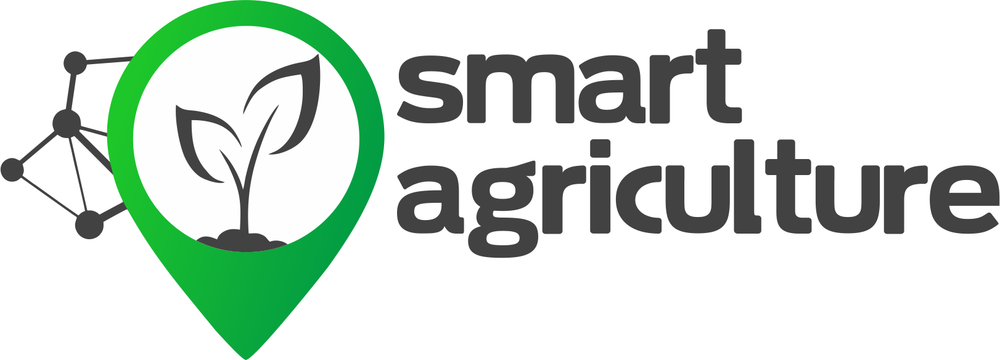
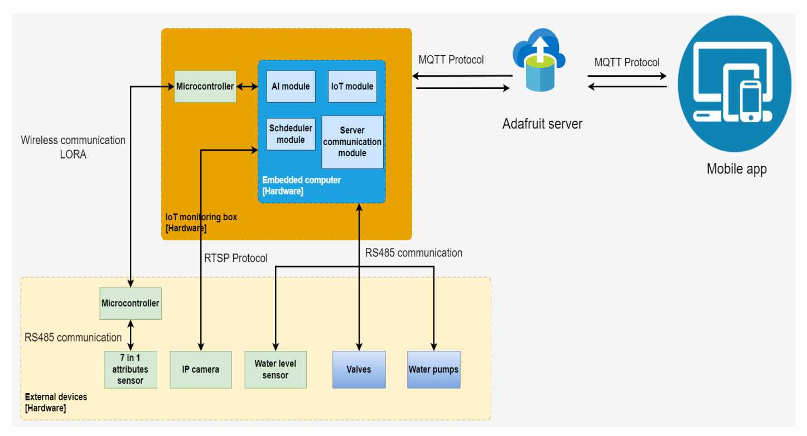

# Smart Agricultural IoT Project in Raspberry PI CM4 - Group HTC (HK223)



## Description

The Smart Agricultural IoT Project, developed by the HTC team, introduces an advanced system for efficient agricultural monitoring and management. Leveraging cutting-edge IoT technologies, including LoRa wireless communication and RS485 protocols, the project aims to optimize resource management and enhance crop health. Real-time monitoring of temperature, humidity, and motion, combined with remote control of devices, forms the backbone of this innovative solution. Swift alert mechanisms and customizable automation rules provide a comprehensive toolkit for effective agricultural processes.


## Key Features
- **Remote Device Control**: Seamlessly control devices like relays and water pumps to optimize resource management, ensuring that your agricultural operations are efficient and effective.

- **Alert Mechanisms**: Receive immediate notifications for critical events and deviations from predefined conditions. This timely awareness empowers you to take swift corrective actions and mitigate potential risks.

- **Custom Automation Rules**: Tailor the system to your specific needs by creating customizable automation rules. These rules help simplify complex agricultural processes, allowing you to focus on other important tasks.

- **Plant Health Monitoring**: Integrate an IP camera to detect and identify plant health issues caused by pests and diseases. With this capability, you can implement targeted solutions to ensure the well-being of your crops.


## System Architecture

For a comprehensive overview of the system architecture and its components .

## Getting Started

Follow these steps to set up and run the Smart Agricultural IoT system on your local environment:

1. Clone the Repository:
   ```sh
   git clone https://github.com/truongtran19315/Smart-agricultural-IoT-HTC_HK223.git
   cd Smart-agricultural-IoT-HTC_HK223

2. Install Dependencies:
   ```sh
   pip install pyserial           # For serial communication with devices.
   pip install requests           # For making HTTP requests to external APIs.
   pip install opencv-python      # Open Source Computer Vision Library.
   pip install customtkinter      # Customized tkinter library (provide installation details).

3. Configure the System:
   
4. Run the Application:
   ```sh
   python3 main.py